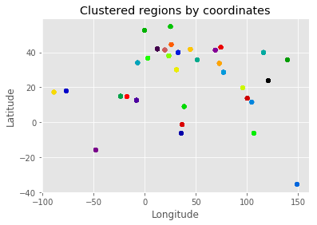
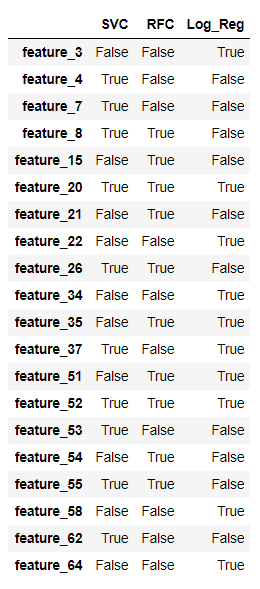
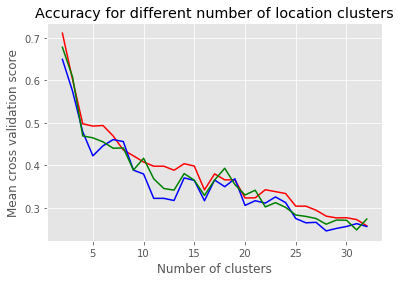
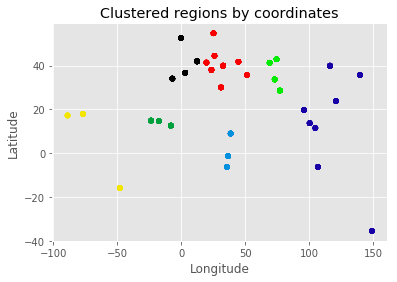
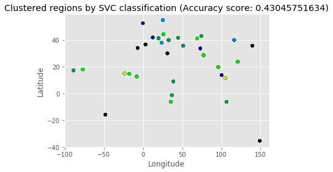
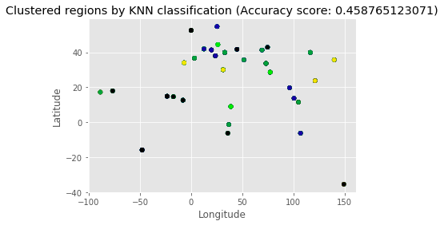
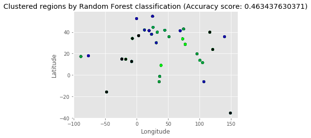

# Predicting the geographical origin of music

## Problem Overview

Different music styles and genres are known to have unique sound wave characteristics. It is also speculated that different geographic regions have their own unique music style with its own unique characteristics. For this project we want to determine whether we can build a machine learning model that can accurately predict the origin of a song based on different sound wave characteristics retrieved from audio files.

The data used for this study was downloaded [here](http://archive.ics.uci.edu/ml/datasets/geographical+original+of+music). Prior exploration has been performed around this question. The most well-known study can be viewed [here](http://ieeexplore.ieee.org/stamp/stamp.jsp?tp=&arnumber=7023456).

## Data Exploaration

The dataset consists of audio features that were extracted using [MARSYAS](http://marsyasweb.appspot.com/). The features that we are using can be seen as the key audio features of a song. We need to predict the geographical region of a song based on these features. The data does not include geographical regions, but rather latitudinal and longitudinal coordinates. We can visualize these regions using clustering.

Even though we have more than 1000 observations, it would appear as if the songs have already been assigned a common coordinate set.

## Feature Selection

We have 68 features, but we have no idea whether all the features are relevant or not.

We can use Python's `RFE` function to perform backward selection and the `PCA` function to reduce dimensionality by minimising the lost variance.

With `PCA` we can determine the amount of variance lost as the dimensions are reduced, but for `RFE` we need an estimator to determine whether omitting a feature will result in a decrease in accuracy score or not. To keep our measurement metrics consistent, we will rather test the reduced dimensionalty of `PCA` in terms of accuracy when using different estimators.

For this reason, we need an estimator to validate the feature selection. We can test `RFE` and `PCA` with a variety of estimators and compare the different feature selection results between the models.

However, because we do not yet know which features to use, it is difficult to know what our hyperparameter values should be for our models. To make sure that we aren't making any assumptions in terms of which hyperparameters work best, we will apply grid search for each feature selection iteration. We can then use the best accuracy obtained for a specific number of features for each estimator.

The problem on hand is a classification problem, which limits the type of estimators we can use. We will be considering the following estimators - random forest, SVM (SVC) with a linear kernel and Logistic Regression. K-nearestneighbours is another possible estimator, but because it does not perform well in high dimensionality, it will not be included during the feature selection process.

Each estimator that is being used, is being trained on training data, and validated using an independent data subset.

The plot below shows the accuracy of the random forest classifier for a range of features, by using backward selection. By observing the different plots, it seemed as if 10 features were sufficient and that backward seelction (blue line) performed better feature selection than PCA.

The table shows the features that were selected per estimator. The features that were selected by non can be omitted from the model.

## Model Building

We can now use this these features to test out the same estimators and include k nearest neighbours.

Using cross validation over a grid of hyperparameters, we obtain the following results as the best results for each estimator.

## Conclusion

The accuracy scores are much lower than desired. However, it must be beared in mind that the clusters in the data aren't necessarily unique in terms of song style.

If we change the amount of clusters, we obtain the following accuracy trend for the different models.

The plot shows that the accuracy decreases exponentially as the number of coordinate clusters increase. This is understandable, because it is more likely of randomly predicting the correct cluster if there are only a few clusters to choose from. The elbow of the curves above is around 7 clusters. No penalty score has been added, which makes it understandable that the slopes continues to decrease after this.

Given the above plot, it would be a good idea to visualise the above three models at 7 neighbours on a coordinate scatterplot.

After applying our the best hyperparameters to each of the three models, we were still not could still not reach 50% accuracy for classifying music by geographic location, even after we reduced the number of cluster to 7.

Random Forest Classification did marginally better than the other two models with an accuracy score of 46.3% when considering 7 geographical clusters.
